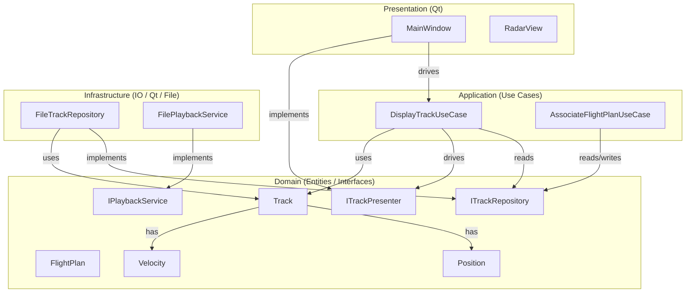
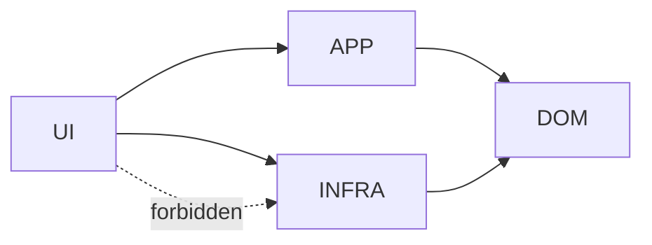
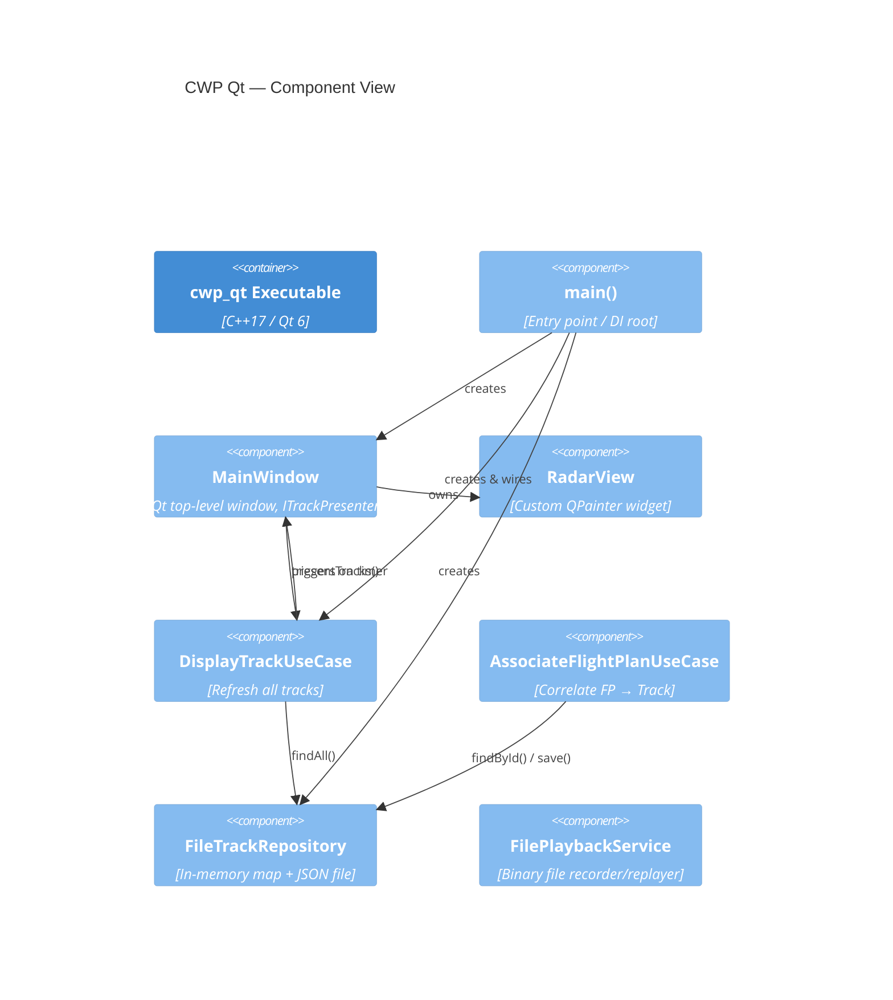
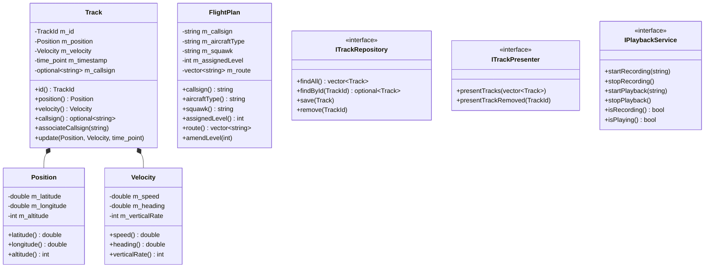
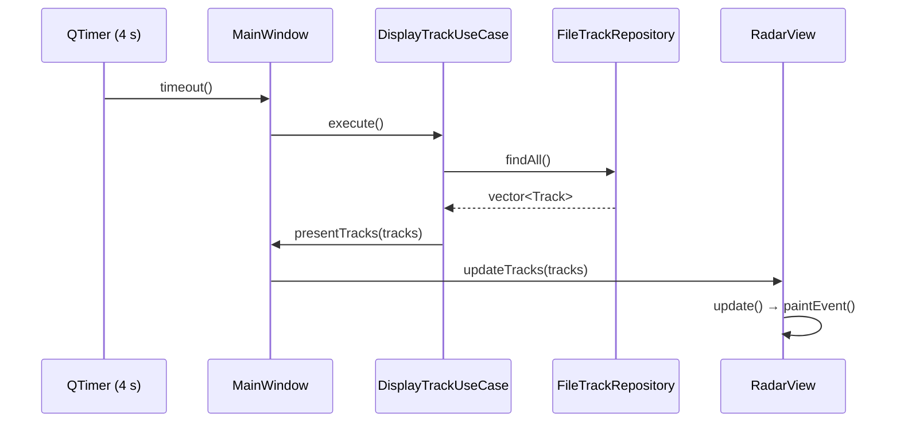
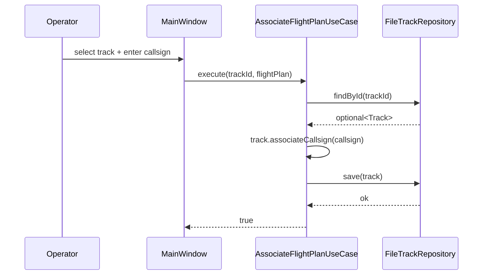
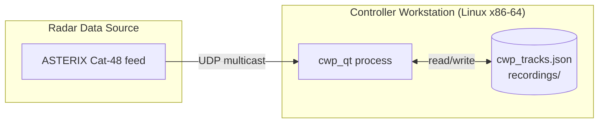

# CWP Qt — Architecture

## 1. Overview

The Controller Working Position (CWP) Qt application modernises a legacy Air Traffic Control workstation by replacing the proprietary ODS Toolbox UI with Qt 6 (C++) and providing an in-house Recording & Playback Service (RPS replacement). The system follows **Clean Architecture** so that business logic is independent of frameworks, databases, and UI libraries.

---

## 2. Layer Diagram

---

## 3. Dependency Rule

> Source code dependencies point **inward only**. Domain has zero outward dependencies.

---

## 4. Component Diagram

---

## 5. Class Diagram — Domain

---

## 6. Sequence — Radar Refresh Cycle

---

## 7. Sequence — Flight Plan Association

---

## 8. Deployment Diagram

