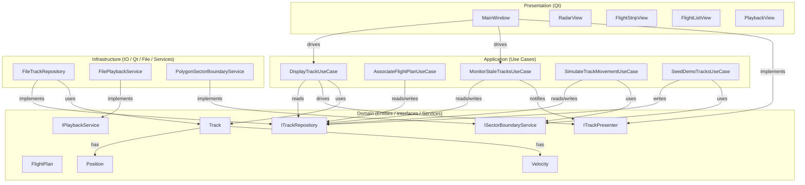
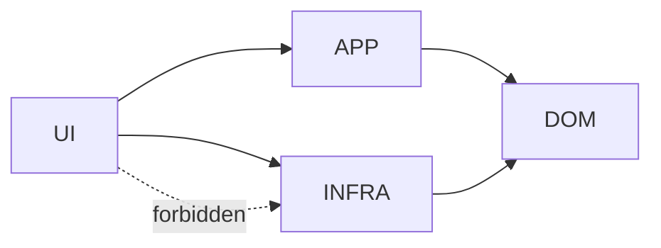
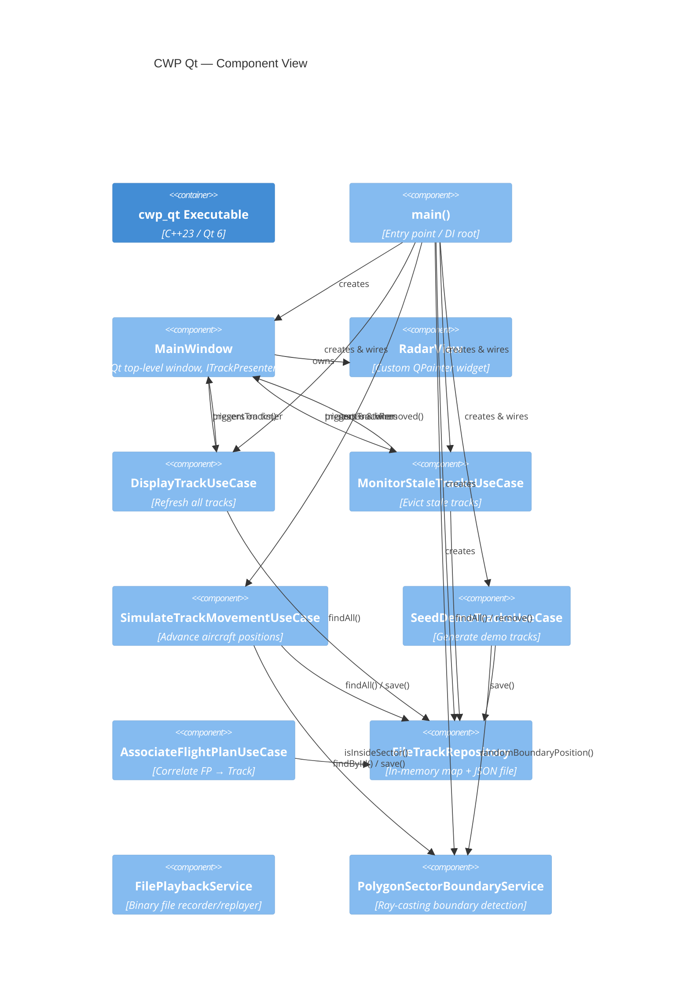
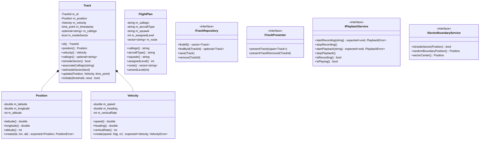
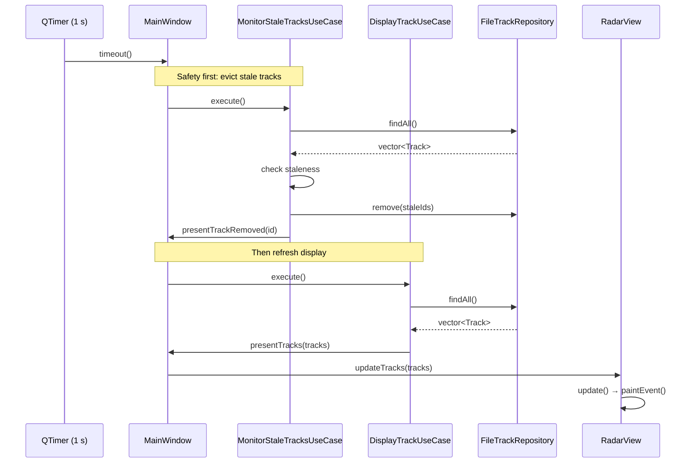
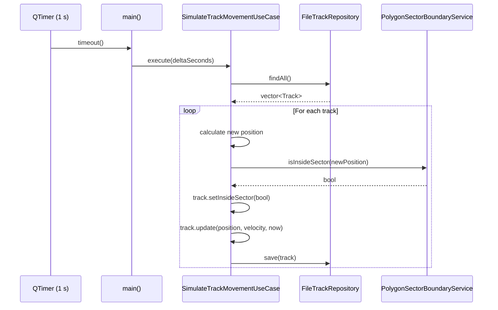
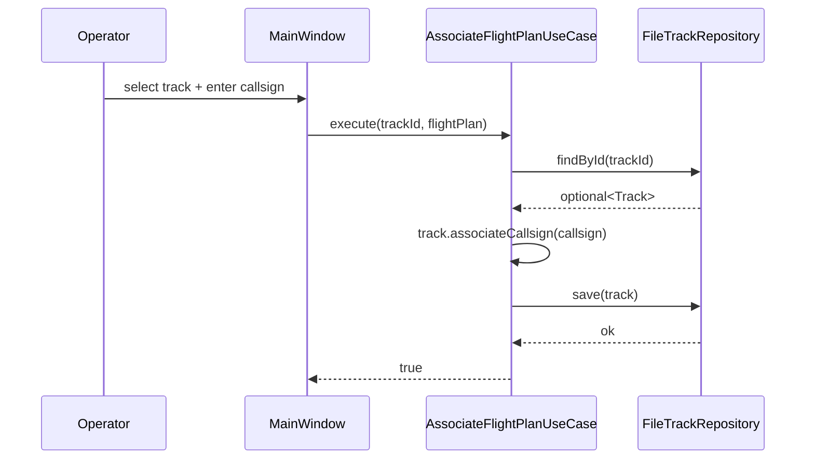

# CWP Qt — Architecture

## 1. Overview

The Controller Working Position (CWP) Qt application modernises a legacy Air Traffic Control workstation by replacing the proprietary ODS Toolbox UI with Qt 6 (C++) and providing an in-house Recording & Playback Service (RPS replacement). The system follows **Clean Architecture** so that business logic is independent of frameworks, databases, and UI libraries.

---

## 2. Layer Diagram



---

## 3. Use Cases Overview

| Use Case | Responsibility | Triggered By |
|----------|----------------|--------------|
| `DisplayTrackUseCase` | Fetch all tracks and present to UI | Timer (1s interval) |
| `MonitorStaleTracksUseCase` | Evict tracks not updated within 60s | Timer (1s interval) |
| `SimulateTrackMovementUseCase` | Advance aircraft positions along velocity vectors | Timer (simulation) |
| `SeedDemoTracksUseCase` | Generate initial demo tracks at sector boundaries | Application startup |
| `AssociateFlightPlanUseCase` | Correlate flight plan with radar track | User action |

---

## 3. Dependency Rule



> Source code dependencies point **inward only**. Domain has zero outward dependencies.

---

## 4. Component Diagram



---

## 5. Class Diagram — Domain


        +remove(TrackId)
    }

    class ITrackPresenter {
        <<interface>>
        +presentTracks(vector~Track~)
        +presentTrackRemoved(TrackId)
    }

    class IPlaybackService {
        <<interface>>
        +startRecording(string)
        +stopRecording()
        +startPlayback(string)
        +stopPlayback()
        +isRecording() bool
        +isPlaying() bool
    }

    Track *-- Position
    Track *-- Velocity
```

---

## 6. Sequence — Radar Refresh Cycle



---

## 7. Sequence — Simulation Cycle



---

## 8. Sequence — Flight Plan Association



---

## 9. Deployment Diagram

```mermaid
graph LR
    subgraph Workstation["Controller Workstation (Linux x86-64)"]
        APP[cwp_qt process]
        FS[(cwp_tracks.json\nrecordings/)]
        CFG[config/\nConfiguration.hpp]
    end

    subgraph Radar["Radar Data Source (Future)"]
        ASTERIX[ASTERIX Cat-48 feed]
    end

    ASTERIX -.->|UDP multicast\n(not yet implemented)| APP
    APP <-->|read/write| FS
    APP -->|compile-time| CFG
```

---

## 10. Design Decisions

### 10.1 Clean Architecture

**Decision**: Strict layered architecture with inward-pointing dependencies.

**Rationale**:
- Domain logic is framework-independent (testable without Qt)
- Easy to swap infrastructure (e.g., PostgreSQL instead of JSON files)
- UI changes don't affect business rules
- Supports long-term maintainability

### 10.2 Use Case Pattern

**Decision**: Each feature encapsulated as a dedicated class.

**Rationale**:
- Single Responsibility Principle
- Testable in isolation
- Clear boundaries for code review
- Matches ATC operational procedures (one use case per action)

### 10.3 Domain Services

**Decision**: Geometry and boundary logic extracted into `ISectorBoundaryService`.

**Rationale**:
- Reusable across multiple sectors
- Testable without UI or simulation
- Thread-safe implementation
- Supports different algorithms (polygon, circle, etc.)

### 10.4 Value Objects with Validation

**Decision**: `Position` and `Velocity` validate inputs in factory methods.

**Rationale**:
- Safety-critical: invalid coordinates cannot enter the system
- Fail-fast at data ingestion boundaries
- `std::expected` forces explicit error handling
- Compiler optimizations with `[[assume]]` hints

### 10.5 Sector Status in Track Entity

**Decision**: Track entity stores `m_insideSector` boolean.

**Rationale**:
- Avoids recalculating geometry on every paint cycle
- Simplifies UI logic (color selection based on simple flag)
- Updated atomically with position changes
- Matches ATC mental model (track is "in my sector" or not)

### 10.6 Trail Management in UI Layer

**Decision**: Trail history managed by `RadarView` widget.

**Rationale**:
- Display-specific concern (not domain logic)
- Qt widget ownership simplifies lifecycle management
- Geographic coordinates stored (not screen pixels) for pan/zoom support
- **Note**: Could be extracted to a service if trails need persistence

### 10.7 Configuration as Compile-Time Constants

**Decision**: Configuration in header file (`config/Configuration.hpp`).

**Rationale**:
- Zero runtime overhead
- Compiler can optimize based on constants
- Simple for development/prototyping
- **Trade-off**: Requires recompilation to change parameters
- **Future**: Could support runtime config files if needed

---

## 11. Technology Stack

| Layer | Technology | Version | Rationale |
|-------|-----------|---------|-----------|
| Language | C++ | 23 | Modern features (std::expected, spaceship, ranges) |
| UI Framework | Qt | 6.2+ | Cross-platform, mature, good QPainter performance |
| Build System | CMake | 3.21+ | Industry standard, good IDE support |
| Testing | Google Test | 1.12+ | Mature, well-documented, parameterized tests |
| VCS | Git | 2.x | Standard version control |

---

## 12. Future Enhancements

### Short Term
1. **JSON Serialization**: Implement persistence in `FileTrackRepository`
2. **Unit Test Coverage**: Add tests for all use cases and services
3. **Error Reporting**: Structured error handling with result types

### Medium Term
4. **ASTERIX Feed Integration**: Real radar data ingestion
5. **Multi-Sector Support**: Load sector definitions from config files
6. **User Preferences**: Persist UI settings (colors, zoom level, etc.)

### Long Term
7. **Distributed System**: Multiple CWP instances sharing data
8. **Conflict Detection**: Automated separation assurance
9. **Voice Integration**: Push-to-talk with radio simulation

---

## 13. References

- **Clean Architecture** — Robert C. Martin (Uncle Bob)
- **Domain-Driven Design** — Eric Evans
- **Qt 6 Documentation** — https://doc.qt.io/qt-6/
- **ICAO Annex 11** — Air Traffic Services
- **ASTERIX Specification** — EUROCONTROL
